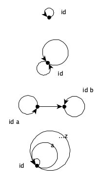
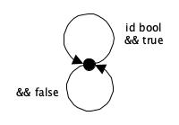
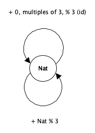

## 3.6.1

## 3.6.2

a) partial order
* every set is in itself  
* sets can be in other sets
* associate A in B, B in C, A in C

b) partial order
* every type is itself
* types are composable (subtyping)
* associative

## 3.6.3

bool { true, false }
a set-theoretical monoid has 2 properties:
* has an associative, binary operator (mappend)
* has a neutral element (mempty)

bool monoid with && (AND)
* a && (b && c) === (a && b) && c
* m && true = m, true && m = m

bool monoid with || (OR)
* (a || b) || c === a || (b || c)
* m || false = m, false || m = m

## 3.6.4

instance Monoid bool where
  mempty b = b && true
  mappend b1 b2 = b1 && b2  

## 3.6.5

